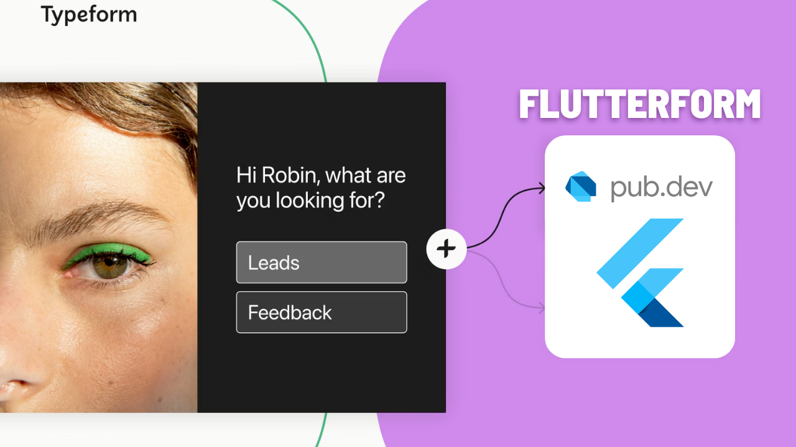
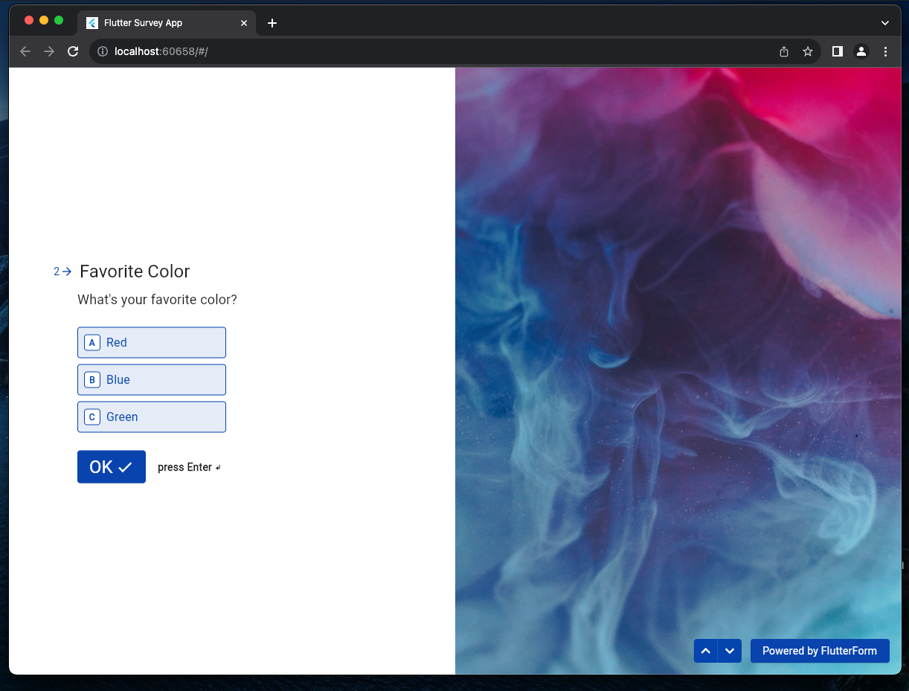
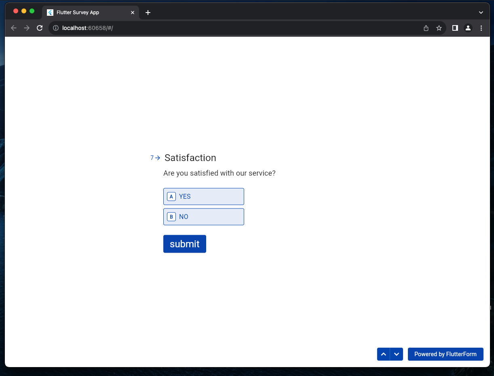
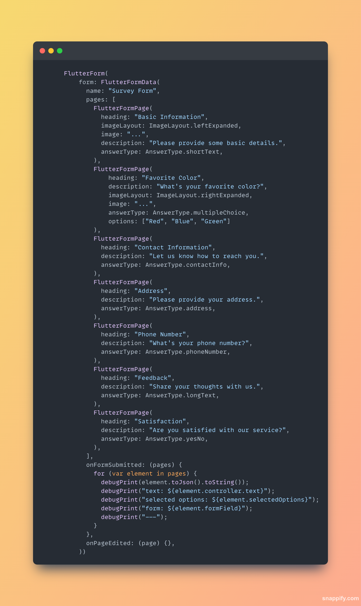

# flutter_form_kit

An Open Source alternative of Typeform for building beautiful forms with customizations.

| **_Image 1_**                 | **_Image 2_**                 | **_Image 3_**                 |
|-------------------------------|-------------------------------|-------------------------------|
|  |  |  |

| **_Image 4_**                 | **_Image 5_**                 |
|-------------------------------|-------------------------------|
|  |  |

## Complete Package YouTube Video Process

## Simple integration:
Adding the form is quite easy, check out the example project to learn more.

## Form Support:

- in Between: A form element positioned between other elements.
- right: A form element aligned to the right.
- left: A form element aligned to the left.
- right Expanded: A form element expanded and aligned to the right.
- left Expanded: A form element expanded and aligned to the left.
- background: A form element used as a background element.

## Image Layout Support:

- short Text: Layout for short text.
- multiple Choice: Layout for multiple-choice options.
- contact Info: Layout for contact information.
- address: Layout for address information.
- phone Number: Layout for phone number information.
- long Text: Layout for longer text.
- yes No: Layout for yes or no options.

## Give a 🤩 to the repository

If you find the project helpful, make sure to give a shiny star 🌟